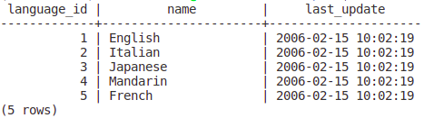
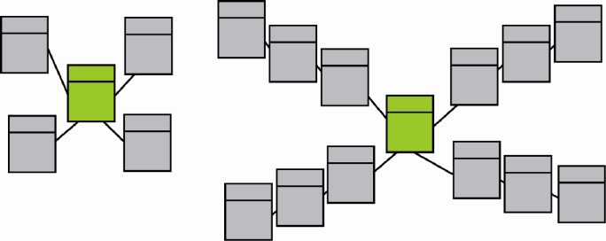

## Project: Data Warehouse on AWS

## Introduction

A music streaming startup, Sparkify, has grown their user base and song database and want to move their processes and data onto the cloud. Their data resides in S3, in a directory of JSON logs on user activity on the app, as well as a directory with JSON metadata on the songs in their app.

As their data engineer, you are tasked with building an ETL pipeline that extracts their data from S3, stages them in Redshift, and transforms data into a set of dimensional tables for their analytics team to continue finding insights in what songs their users are listening to. You'll be able to test your database and ETL pipeline by running queries given to you by the analytics team from Sparkify and compare your results with their expected results.

## Project Description

In this project, you will need to load data from S3 to staging tables on Redshift and execute SQL statements that create the analytics tables from these staging tables.

## Project Datasets

You'll be working with two datasets that reside in S3. Here are the S3 links for each:

* Song data: s3://udacity-dend/song_data
* Log data: s3://udacity-dend/log_data

Log data json path: s3://udacity-dend/log_json_path.json

### Song dataset

The first dataset is a subset of real data from the Million Song Dataset. Each file is in JSON format and contains metadata about a song and the artist of that song. The files are partitioned by the first three letters of each song's track ID

Example of file name partition, name and content:

`A/A/A/TRAAAAW128F429D538.json`
<br>
```json
{
   "num_songs":1,
   "artist_id":"ARD7TVE1187B99BFB1",
   "artist_latitude":null,
   "artist_longitude":null,
   "artist_location":"California - LA",
   "artist_name":"Casual",
   "song_id":"SOMZWCG12A8C13C480",
   "title":"I Didn't Mean To",
   "duration":218.93179,
   "year":0
}
```

### Log dataset

The second dataset consists of log files in JSON format generated by this event simulator based on the songs in the dataset above. These simulate app activity logs from an imaginary music streaming app based on configuration settings.

The log files in the dataset you'll be working with are partitioned by year and month. For example, here are filepaths to two files in this dataset.

Example of file partition, name and content:

`2018/11/2018-11-01-events`
<br>
```json
{
   "artist":null,
   "auth":"Logged In",
   "firstName":"Walter",
   "gender":"M",
   "itemInSession":0,
   "lastName":"Frye",
   "length":null,
   "level":"free",
   "location":"San Francisco-Oakland-Hayward, CA",
   "method":"GET",
   "page":"Home",
   "registration":1540919166796.0,
   "sessionId":38,
   "song":null,
   "status":200,
   "ts":1541105830796,
   "userAgent":"\"Mozilla\/5.0 (Macintosh; Intel Mac OS X 10_9_4) AppleWebKit\/537.36 (KHTML, like Gecko) Chrome\/36.0.1985.143 Safari\/537.36\"",
   "userId":"39"
}
```

## Schema

### FACT TABLES

1. **songplays** - records in log data associated with song plays
    * *songplay_id, start_time, user_id, level, song_id, artist_id, session_id, location, user_agent*

<br>

### DIMENSION TABLES

2. **users** - users in the app
    * *user_id, first_name, last_name, gender, level*

3. **songs** - songs in music database
    * *song_id, title, artist_id, year, duration*

4. **artists** - artists in music database
    * *artist_id, name, location, latitude, longitude*

5. **time** - timestamps of records in songplays broken down into specific units
    * *start_time, hour, day, week, month, year, weekday*


## Project Template

* **sql_queries.py** - is where you'll define you SQL statements, which will be imported into the two other files above.
* **create_table.py** - is where you'll create your fact and dimension tables for the star schema in Redshift.
* **etl.py** - is where you'll load data from S3 into staging tables on Redshift and then process that data into your analytics tables on Redshift.

## Project Steps

### Create Table Schemas

1. Design schemas for your fact and dimension tables
2. Write a SQL CREATE statement for each of these tables in sql_queries.py
3. Complete the logic in create_tables.py to connect to the database and create these tables
4. Write SQL DROP statements to drop tables in the beginning of create_tables.py if the tables already exist. This way, you can run create_tables.py whenever you want to reset your database and test your ETL pipeline.
5. Launch a redshift cluster and create an IAM role that has read access to S3.
6. Add redshift database and IAM role info to dwh.cfg.
7. Test by running create_tables.py and checking the table schemas in your redshift database. You can use Query Editor in the AWS Redshift console for this.

### Build ETL Pipeline

1. Implement the logic in etl.py to load data from S3 to staging tables on Redshift.
2. Implement the logic in etl.py to load data from staging tables to analytics tables on Redshift.
3. Test by running etl.py after running create_tables.py and running the analytic queries on your Redshift database to compare your results with the expected results.
4. Delete your redshift cluster when finished.

**Note**: The SERIAL command in Postgres is not supported in Redshift. The equivalent in redshift is IDENTITY(0,1)

<br>

## Configurations

### Pagila database

To run a postgres docker container locally:<br>
`docker run --name postgres-pagila -p 5432:5432 -e POSTGRES_PASSWORD=student -e POSTGRES_USER=student -e POSTGRES_DB=pagila -d postgres`

To install pagila database, we need to follow a few steps:
1. Download pagila scripts to create schema & insert data. You can download them from https://www.postgresql.org/ftp/projects/pgFoundry/dbsamples/pagila/pagila/
2. Change the owner name inside script from "**postgres**" to "**student**"
3. With a postgres container running, execute the **pagila-schema.sql** file to create schema: <br>
`cat $(pwd)/udacity-dataeng/cloud-data-warehouse/pagila-scripts/pagila-schema.sql | docker exec -i postgres-pagila psql -U student -d pagila` 
4. Final, insert data in your tables: <br> 
`cat $(pwd)/udacity-dataeng/cloud-data-warehouse/pagila-scripts/pagila-data.sql | docker exec -i postgres-pagila psql -U student -d pagila`

Reminder: If you're in local repository, change the location where your files are

Now you can select some data:<br>
`docker exec -it postgres-pagila psql -U student -d pagila -c "SELECT * FROM {table_name} LIMIT 5"`




### AWS Environment

To configure our AWS environment, Instead of using Udacity plataform to create our resources, I'll use Terraform since is more practical and a great tool to work with infrastructure as code.

If you're using udacity environment, make sure to create a token variable and pass as argument in environment-aws.tf file inside aws provider

After that, i'm gonna use a Docker image to create a workstation, it will install everything that we need and be used for create and change aws resources using terraform, also put data inside s3 buckets using AWS CLI.

Here's the steps:

Before build docker image, we need to fill AWS variables in Dockerfile: 
* AWS_ACCESS_KEY_ID
* AWS_SECRET_ACCESS_KEY
* AWS_ACCOUNT_ID
* AWS_ROLE_ARN

Make sure Role has sufficient permissions to execute AWS CLI commands.

With docker installed, build our image using: <br>
`docker build . -t aws-env`

Then run docker: <br>
`docker run -it aws-env`

Running this image will start a bash inside of it, we are ready for inicializate terraform.<br>
`terraform init`

Now apply our terraform resources to our AWS account<br>
`terraform apply -var 'aws_access_key={access_key}' -var 'aws_secret_key={secret_key}' -var 'aws_region={region}' -var 'aws_s3_bucket_name={bucket-name}' -auto-approve`

*Change values from {} to your parameters*

After all resources was created, we need to copy our data to S3 bucket using AWS CLI:<br>

aws s3 cp "data" s3://{bucket-name} --recursive

*Change {bucket-name} with your bucket name specified in environment-aws.tf variables. Also change in dwh.cfg file*

When we done, destroy everything:<br>
`terraform destroy -var 'aws_access_key={access_key}' -var 'aws_secret_key={secret_key}' -var 'aws_region={region}' -var 'aws_s3_bucket_name={bucket-name}' -auto-approve`

**Reminder 1: Before destroy, S3 must be cleaned using AWS CLI:**<br>
`aws s3 rm s3://{bucket-name} --recursive`

**Reminder 2: Do not exit from your Docker image without destroy every resources from AWS using terraform. Terraform apply's create states of our modifications to AWS, after exit, terraform will no longe be able to identify and destroy resources that we created**

**Reminder 3: Amazon Redshift credentials are stored in environment-aws.tf file (aws_redshift_cluster.redshift_cluster).**

## Learning Path

### Introduction

What is a data warehouse?

- Data warehouse is a copy of transaction data specifically structured for **query** and **data analysis**. (*ref. Kimball*)
- It is a subject-oriented, integrated, nonvolatile, and time-variant collection of data in **support of management's decisions**. (*ref. Inmon*)
- DW is a system that retrieves and consolidates data **periodically** from the source into a **dimensional** or **normalized** data store. It usually keeps years of **history** and is queried for *business intelligence* or other **analytical activities**. It is typically updated in **batches**. (*ref. Rainardi*)

<br>

### Dimensional Modelling

Relational databases became hard to analytics due joins that we have to do for analytical insights and it's difficult to understand. Dimensional modelling comes to make it more easy.

There's 2 types of dimensional modelling 

**Star Schema** (left) and **Snow Flake** (right)



<br>

### Facts Tables
* Record business events
* Columns recorded events in **quantifiable metrics**
* Numeric & Additive
* e.g: quantity of an item, duration of a call, a rating

### Dimension Tables
* Record the context of business events (who, what, where, why, how)
* Columns contain **attributes**
* e.g: Customer name, Item color, etc...

<br>

### OLAP Cube Operations

**Roll-up**: We summerize all categories into only one category, rolling up the branch dimension, e.g: City -> State -> Country

**Drill-Down**: Same as roll-up but decomposing our data to get more values, e.g: Country -> State -> City

**That's why OLAP cube should store the finest grain of data**

**Slice**: Reduce amount of dimensions from a single value, e.g: Filter only 1 specific month, should reduce date dimension

**Dice**: In dice we still have the same number of dimensions, but we reduce our values from a dimension, e.g: Filter months in 'february' and 'march', movie in 'batman' and 'avatar' and city in 'ny' and 'ca'

### Optimizing table design

Optimizing table is a very important concept that allow us to have fast queries running in Redshift arquitecture

There's 4 types of distribution:

* **Even** distribution: Splitting data into multiple nodes to achieve load-balancing, it's a good choice if table doesn't have JOIN's operations.
* **All** distribution: All data are copy into all nodes, used frequently for dimension tables
* **Auto** distribution: Leaves decision to Redshift. Small enough tables are distributed with an ALL strategy, while large tables are distributed with EVEN strategy
* **Key** distribution: Rows having similar values are placed in the same slice, and it's can lead to a skewed distribution because some values could be more frequent than others. Very useful when a dimensinal table is too big for ALL strategy, in this case we distribute both fact and dimension tables using same key. If two tables are distributed on join keys, Redshift allocates the row from both tables on the same slice
* **Sorting keys**: Define a column as sort key as result columns are sorted before distribution to nodes. Useful for columns that are used in sorting like date dimension or foreign keys in fact table