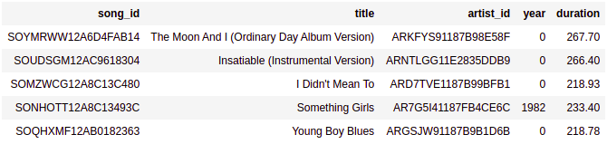

## Project: Data Modeling with Postgres

### Introduction

A startup called Sparkify wants to analyze the data they've been collecting on songs and user activity on their new music streaming app. The analytics team is particularly interested in understanding what songs users are listening to. Currently, they don't have an easy way to query their data, which resides in a directory of JSON logs on user activity on the app, as well as a directory with JSON metadata on the songs in their app.

They'd like a data engineer to create a Postgres database with tables designed to optimize queries on song play analysis, and bring you on the project. Your role is to create a database schema and ETL pipeline for this analysis. You'll be able to test your database and ETL pipeline by running queries given to you by the analytics team from Sparkify and compare your results with their expected results.

### Project Description

In this project, you'll apply what you've learned on data modeling with Postgres and build an ETL pipeline using Python. To complete the project, you will need to define fact and dimension tables for a star schema for a particular analytic focus, and write an ETL pipeline that transfers data from files in two local directories into these tables in Postgres using Python and SQL.

<br>

## Dataset

### Song dataset

The first dataset is a subset of real data from the Million Song Dataset. Each file is in JSON format and contains metadata about a song and the artist of that song. The files are partitioned by the first three letters of each song's track ID. 

Example of file name partition, name and content:

`A/A/A/TRAAAAW128F429D538.json`
<br>
```json
{
   "num_songs":1,
   "artist_id":"ARD7TVE1187B99BFB1",
   "artist_latitude":null,
   "artist_longitude":null,
   "artist_location":"California - LA",
   "artist_name":"Casual",
   "song_id":"SOMZWCG12A8C13C480",
   "title":"I Didn't Mean To",
   "duration":218.93179,
   "year":0
}
```
<br>

### Log dataset

The second dataset consists of log files in JSON format generated by this event simulator based on the songs in the dataset above. These simulate activity logs from a music streaming app based on specified configurations.

The log files in the dataset you'll be working with are partitioned by year and month. For example, here are filepaths to two files in this dataset.

Example of file partition, name and content:

`2018/11/2018-11-01-events`
<br>
```json
{
   "artist":null,
   "auth":"Logged In",
   "firstName":"Walter",
   "gender":"M",
   "itemInSession":0,
   "lastName":"Frye",
   "length":null,
   "level":"free",
   "location":"San Francisco-Oakland-Hayward, CA",
   "method":"GET",
   "page":"Home",
   "registration":1540919166796.0,
   "sessionId":38,
   "song":null,
   "status":200,
   "ts":1541105830796,
   "userAgent":"\"Mozilla\/5.0 (Macintosh; Intel Mac OS X 10_9_4) AppleWebKit\/537.36 (KHTML, like Gecko) Chrome\/36.0.1985.143 Safari\/537.36\"",
   "userId":"39"
}
```

<br>

## Data Modeling

### FACT TABLES

1. **songplays** - records in log data associated with song plays
    * *songplay_id, start_time, user_id, level, song_id, artist_id, session_id, location, user_agent*

<br>

### DIMENSION TABLES

2. **users** - users in the app
    * *user_id, first_name, last_name, gender, level*

3. **songs** - songs in music database
    * *song_id, title, artist_id, year, duration*

4. **artists** - artists in music database
    * *artist_id, name, location, latitude, longitude*

5. **time** - timestamps of records in songplays broken down into specific units
    * *start_time, hour, day, week, month, year, weekday*

<br>

## Project Template

* **test.ipynb** - displays the first few rows of each table to let you check your database.
* **create_tables.py** - drops and creates your tables. You run this file to reset your tables before each time you run your ETL scripts.
* **etl.ipynb** - reads and processes a single file from song_data and log_data and loads the data into your tables. This notebook contains detailed instructions on the ETL process for each of the tables.
* **etl.py** - reads and processes files from song_data and log_data and loads them into your tables. You can fill this out based on your work in the ETL notebook.
* **sql_queries.py** - contains all your sql queries, and is imported into the last three files above.

<br>

## ETL & Pipeline

Follow instructions in the etl.ipynb notebook to develop ETL processes for each table. At the end of each table section, or at the end of the notebook, run test.ipynb to confirm that records were successfully inserted into each table. Remember to rerun create_tables.py to reset your tables before each time you run this notebook.

Use what you've completed in etl.ipynb to complete etl.py, where you'll process the entire datasets. Remember to run create_tables.py before running etl.py to reset your tables. Run test.ipynb to confirm your records were successfully inserted into each table.

<br>

## Template Result

**songplays** table:<br>


**artists** table:<br>


**songs** table:<br>


**users** table:<br>


**time** table:<br>


<br>

## Configurations

To run a postgre container locally:

`docker run -p 5432:5432 -e POSTGRES_PASSWORD=student -e POSTGRES_USER=student -e POSTGRES_DB=sparkifydb -d postgres`